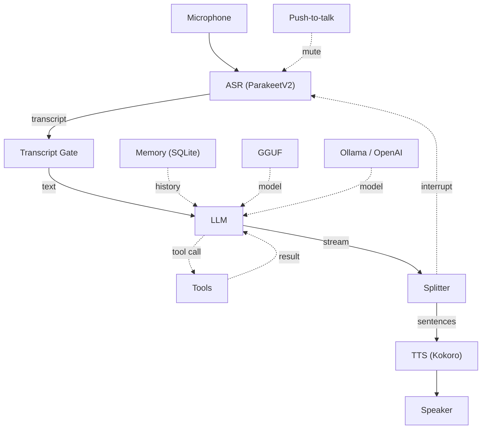

# voxpipe — Modular Voice Pipeline

[](LICENSE)
[]()
[](https://github.com/shervinemp/voxpipe/actions/workflows/ci.yml)

A modular voice-controlled pipeline. Speak, the LLM processes your intent
with tool calling, and the system responds aloud — all streaming,
interruptible, and configurable.



## Quick Start

```bash
# 1. Install
uv sync

# 2. Configure
cp config.example.yaml config.yaml

# 3. Run
uv run voxpipe
```

## Features

| Layer | What |
|---|---|
| **ASR** | Speech-to-text (ParakeetV2) with VAD, push-to-talk, device auto-reconnect |
| **LLM** | Local GGUF models or remote APIs (Ollama, OpenAI, Gemini) via LiteLLM |
| **TTS** | Voice feedback (Kokoro) with interrupt on new input |
| **Tools** | OpenAI-compatible tool calling with streaming decoders and chaining |
| **Memory** | Conversation history with SQLite + FTS5, auto-injects relevant context |
| **Hotkeys** | Push-to-talk and conversation reset |

## Configuration

```yaml
llm:
  backend: "local"       # "local" (GGUF) or "litellm" (remote APIs)
  model: "Gemma4_12B"
  local:
    Gemma4_12B:
      decoder: "legacy_xml"
  litellm:
    provider: "ollama"
    model: "qwen3:latest"
    api_base: "http://localhost:11434"

hotkeys:
  push_to_talk: "<ctrl_r>+<shift_r>"
  press_to_reset: "<ctrl_l>+<ctrl_r>"

conversation_history:
  enabled: true
  db_path: "data/conversations.db"
  max_entries: 1000
  top_k: 2
  ttl_days: 30
```

## Architecture

```
src/
└── voxpipe/
    ├── core/            # Config (YAML + env vars), exceptions, utilities
    ├── asr/             # Speech-to-text (ParakeetV2, Silero VAD)
    ├── tts/             # Text-to-speech (Kokoro ONNX, audio player)
    ├── llm/             # Session, tools, decoders, model loading
    ├── pipeline/        # ASR → LLM → TTS orchestration
    ├── streaming/       # Sentence splitting
    ├── storage/         # Retriever ABC, Memory, model downloads
    └── data/            # Default config, model manifests
```

### Pipeline flow

1. **ASR** captures audio, VAD segments speech, push-to-talk mutes when idle
2. **Transcript gate** filters noise and adds annotations
3. **Memory** injects relevant past conversation as `(Earlier: ...)` context
4. **LLM** processes the augmented query with tool calling
5. **Sentence splitter** streams the response, yielding one sentence at a time
6. **TTS** speaks each sentence; new input interrupts playback (barge-in)

### LLM Backends

**Local GGUF** — config-driven, no hardcoded model classes.

```yaml
llm:
  local:
    Qwen3:
      n_ctx: 40960
      decoder: "legacy_xml"
    MyModel:
      model_path: "model_files/llm/my_model.gguf"
```

**LiteLLM** — OpenAI, Gemini, Ollama, Anthropic, etc.

```yaml
llm:
  backend: "litellm"
  litellm:
    provider: "openai"
    model: "gpt-4o"
```

## License

MIT
